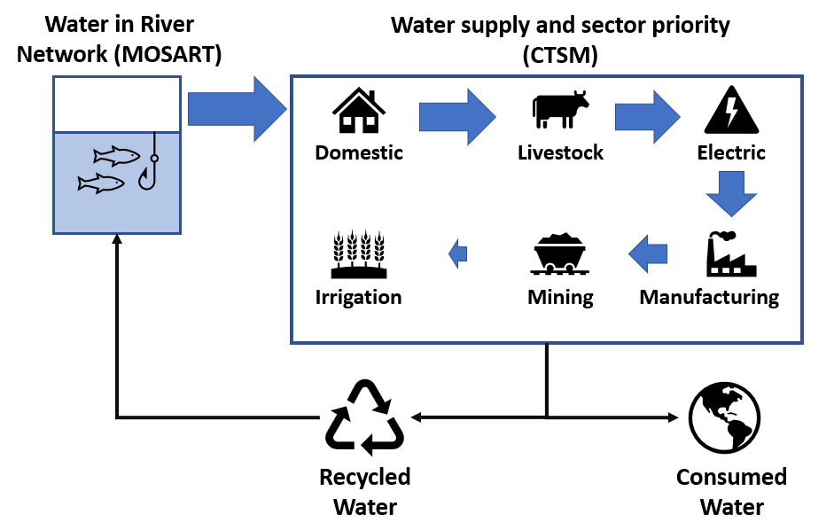

## General discussion:
Describing human-water interactions is one of the grand challenges in Earth system modelling. Despite previous initiatives (GEWEX, 2012), limited progress was made in this direction.

The main objective of our project is to reduce this gap, by enhancing the Community Earth System Model to support all major water use sectors, including domestic, livestock, thermoelectric, manufacturing, mining and irrigation.

By accounting for human water usage patterns in an Earth system model, it will be possible to improve our current understanding of the interplay between water demand and supply in a changing climate. Some possible applications may be:

(1)   Identify regions experiencing water scarcity and explicitly assess to which extent water resources limitation are hindering socio-economic development through unmet demand across sectors.

(2)   Explore future scenarios of climate change and the associated risks for regional and global water security.

(3)   Analyze instances of sectoral competition for limited water resources and associated socio-economic stress.

(4)   Understand how long term water management strategies may improve resilience against hydrological droughts and hot extremes.

## Represented processes:
Figure 1 shows a schematic depiction of the implementation of sectoral water abstractions in the Community Earth System Model. While irrigation and other sectors are represented together, it should be mentioned that irrigation was already implemented in CESM since 2013. You can read more about this in the dedicated page [Irrigation in CTSM](Irrigation/irrig2013). Nonetheless, in our current implementation, all sectors become connected through the competition for limited water resources provided by the river network.

The water withdrawals and consumption fluxes are computed daily in the land component of the model, *CTSM*. 

For irrigation, the demand is computed based on soil moisture deficit at the beginning of each day. The water is then supplied from the gridcell river network and applied on surface soil (or differently depending on the used irrigation technique) where it can supply plants with water, but also influence surface water/energy balance. 

For other sectors, instead of deriving the sectoral demand and consumption from predictors (usually based on GDP and population), we prefer to rely on existing [datasets](Input_Data.md). The water necessary to satisfy the demand is then again provided from the river network (achieved through coupling with the MOSART routing model). Part of the used water is recycled and sent back to the river model, and the other part is considered inefficiently managed and disposed on surface soil over areas with natural vegetation where it contribute to the water/energy surface balance through evaporation, infiltration and runoff.

Finally, a basic sectoral priority algorithm is implemented, with water supplied by order of priority from domestic to irrigation. This way, in situations when water is scarce, sectors will compete for limited resources. The current algorithm may be improved in the future, to allow different strategies of water management under limited resource availability.

## Source code development:
- [Changes Tracker CTSM](CTSM/Changes_Tracker_CTSM.md)
- [Changes Tracker CMEPS](CMEPS/Changes_Tracker_CMEPS.md)
- [Changes Tracker CPL7](CPL7/Changes_Tracker_CPL7.md)
- [Changes Tracker MOSART](MOSART/Changes_Tracker_MOSART.md)

