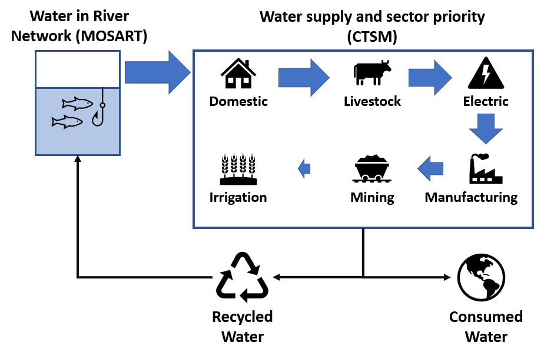

## General description:
Describing human-water interactions is one of the grand challenges in Earth system modelling. Despite previous initiatives (GEWEX, 2012), limited progress was made in this direction.

The main objective of our project is to reduce this gap, by enhancing the Community Earth System Model to support all major water use sectors, including domestic, livestock, thermoelectric, manufacturing, mining and irrigation.

Instead of deriving the sectoral demand and consumption from predictors, we will rely instead on available [datasets](./Input_Data.md). But the development will be done in such a way, that it will be relatively simple to build on it in the future by adding new functionalities (e.g. demand based on predictors).

By accounting for human water usage patterns in an Earth system model, it will be possible to improve our current understanding of the interplay between water demand and supply in a changing climate. Some possible applications may be:

(1)   Identify regions experiencing water scarcity and explicitly assess to which extent water resources limitation are hindering socio-economic development through unmet demand across sectors.

(2)   Explore future scenarios of climate change and the associated risks for regional and global water security.

(3)   Analyze instances of sectoral competition for limited water resources and associated socio-economic stress.

(4)   Understand how long term water management strategies may improve resilience against hydrological droughts and hot extremes.

## Represented processes:
A schematic depiction of the implementation of sectoral water abstractions in the Community Earth System Model. The water withdrawals and consumption fluxes are computed daily in the land component of the model, CTSM. The water necessary to satisfy the demand is provided from the river network (achieved through coupling with the MOSART routing model). Basic sectoral priority is implemented, with water supplied by order of priority from domestic to irrigation. Part of the used water is recycled and sent back to the river model, and the other part is considered lost and disposed on surface soil where it evaporates or infiltrate into the ground.

The main features of this development are:
1. Daily withdrawal and consumption fluxes are computed using the input data. `land component`
2. Withdrawal is satisfied from both surface (river water) and groundwater sources (unconfined gw). The withdrawal from groundwater is done only if there is no sufficient water in river storage. `land component`
3. The consumed water is applied on surface soil over natural vegetation (and potentially pervious roads). `land component`
4. The withdrawal and return flow fluxes are transferred to the routing component (MOSART). `coupler`
5. The return flow is computed as the difference between actual withdrawal and consumption. `routing`
6. The updated river volume is sent back to the land model (at the coupling frequency). `coupler`

	Following this approach we assure conservation of water, and at the same time account for the sectoral water usage impact on surface energy budget over land since consumption is directly applied to the soil surface.

## Source code development:
- [Changes Tracker CTSM](./CTSM/Changes_Tracker_CTSM.md)
- [Changes Tracker CMEPS](./CMEPS/Changes_Tracker_CMEPS.md)
- [Changes Tracker CPL7](./CPL7/Changes_Tracker_CPL7.md)
- [Changes Tracker MOSART](./MOSART/Changes_Tracker_MOSART.md)

